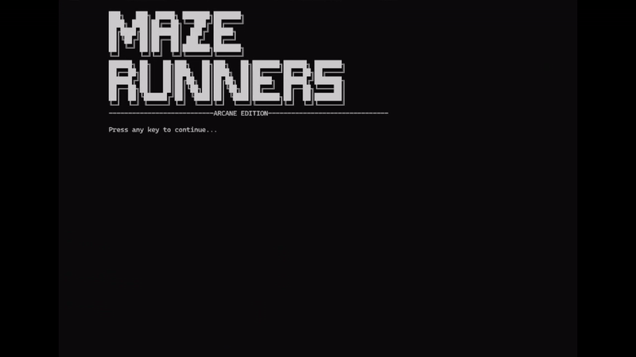

            ███╗   ███╗ █████╗ ███████╗███████╗                          
            ████╗ ████║██╔══██╗╚══███╔╝██╔════╝                          
            ██╔████╔██║███████║  ███╔╝ █████╗                            
            ██║╚██╔╝██║██╔══██║ ███╔╝  ██╔══╝                            
            ██║ ╚═╝ ██║██║  ██║███████╗███████╗                          
            ╚═╝     ╚═╝╚═╝  ╚═╝╚══════╝╚══════╝                          
            ██████╗ ██╗   ██╗███╗   ██╗███╗   ██╗███████╗██████╗ ███████╗
            ██╔══██╗██║   ██║████╗  ██║████╗  ██║██╔════╝██╔══██╗██╔════╝
            ██████╔╝██║   ██║██╔██╗ ██║██╔██╗ ██║█████╗  ██████╔╝███████╗
            ██╔══██╗██║   ██║██║╚██╗██║██║╚██╗██║██╔══╝  ██╔══██╗╚════██║
            ██║  ██║╚██████╔╝██║ ╚████║██║ ╚████║███████╗██║  ██║███████║
            ╚═╝  ╚═╝ ╚═════╝ ╚═╝  ╚═══╝╚═╝  ╚═══╝╚══════╝╚═╝  ╚═╝╚══════╝
This repository hosts the code and resources for a first-year college project: a maze game developed in C#. Created as part of a Programming course, the project demonstrates foundational programming skills in C# and explores concepts in game design and logic.

## Demo

Welcome to **Maze Runners**! Navigate through a dynamically generated maze, avoid traps, and race to the exit before your opponent does.

## 🎯 Objective
Your goal is to escape the maze by reaching the **exit** located in the top-left corner. But beware! The maze is filled with traps like **Darts**, **Sand**, and **Wizards** that can slow you down or harm you. Use your skills wisely to outsmart your opponent and claim victory!

Good luck, and may the best maze runner win! 🏃‍♂️🏃‍♀️

# 🎮 Game Controls

- **⬆️⬇️⬅️➡️ Arrow Keys**: Move the player in the maze  
- **R**: 🎲 Roll the dice  
- **1️⃣ 2️⃣ 3️⃣ 4️⃣ 5️⃣**: Select the token  
- **⏎ Enter**: ✅ Confirm selection or action  
# Prerequisites
Ensure you have the following installed on your system:
  
- [.NET SDK](https://dotnet.microsoft.com/en-us/download/dotnet)

To check if .NET is installed, open a terminal or command prompt and run:
dotnet --version
If you see a version number, .NET is installed.

# Running the Game
Follow these steps to run your .NET console game:

1. Navigate to the alpha\bin\Debug\net8.0\ folder 
2. Locate alpha.exe file and run it.

# Timeline and Features

| Task Name                     | Status          | Importance | Notes                                                                 |
|-------------------------------|-----------------|------------|-----------------------------------------------------------------------|
| Static Board                  | Done | Low        |                                                                       |
| Player Moving/In Bounds       | Done | High       |                                                                       |
| Wall collision                | Done | High       |                                                                       |
| Two players moving            | Done | High       |                                                                       |
| Champions and Champion selection | Done | High     |                                                                       |
| Turns                         | Done | High     |                                                                       |
| Dice throws                   | Finally done | High     | At the beginning of each turn, the player rolls the dice. When they finish their moves, a message appears saying that their turn is over and the other player must roll. |
| Maze Generation Algorithm     | Finally done | High       | Depth First Search (considered Prim)                                  |
| Health/Player death           | Done | Low        | Player dies when its health reaches 0, respawns in the center square  |
| Win condition                 | Done | High       | The exit is in the top-left corner. The players start in the center, and the goal is to reach the exit. |
| Basic UI                      | Done | Low        |                                                                       |
| Traps             | Done | High     | **Dart** - Player health is decreased by 1 **Sand** - Player loses the rest of its turn **Wizard** - Player is teleported to the other player's position |
| Randomize traps and objects   | Done | Medium     |                                                                       |
| Skills and Cooldowns          | Done | High       | **Vi: Lucky Charm** - There is a 1 in 1000 chance to be teleported to the exit **Calibre: Mercy** - There is a 50% chance that if health reaches 0, a health point is granted **Jayce: Heal** - Gains +1 health every 5 turns **Viktor: Sprint** - Gains +1 to dice throw every 5 turns **Jinx: Tap Disarm** - Can disarm all traps |

# 🎮 Architecture

## Classes
- **Game**: Manages the main game logic and flow.
- **BoardGeneration**: Handles the creation and display of the maze board.
- **Token**: Represents the player tokens (characters like Vi, Caitlyn, etc.).
- **Trap**: Manages traps and their effects on players.
- **AsciiArt**: Handles ASCII art displays, such as the "YOU WON" message.

## Description of the Game Loop

The game loop is the core mechanism that keeps the game running until a player wins.

1. **Console.Clear**:  
   The console screen is cleared at the start of each iteration to ensure the display is updated correctly and free of previous output.
   (Just don't scroll it will break the magic). The game works by clearing and reprinting the board.

2. **BoardDisplay Method**:  
   The current state of the maze is rendered, showing the positions of the players (tokens), traps, and other objects. This provides a visual representation of the game world.

3. **ShowUI Method**:  
   The user interface is displayed, which includes relevant information such as player stats, turn details, or instructions for the current player.

4. **TurnManagement Method**:  
   The turn management system handles player actions, including rolling the dice, moving tokens,activating skills, managing cooldowns and interacting with traps or objects. It will wait for the player input to continue with the execution.

5. **WinCondition Method**:  
   After each turn, the game checks if the win condition has been met (e.g., a player reaches the exit). If the condition is satisfied, the loop ends.

6. **YOUWON**:  
   Once the loop ends, a "YOU WON" message is displayed using ASCII art to celebrate the winning player.

# 🔗 Useful Links

- **[Maze Generation Algorithms](https://en.wikipedia.org/wiki/Maze_generation_algorithm)**: Explore various algorithms used for generating mazes, including Depth-First Search, Prim's algorithm, and more.  
- **[Depth-First Search (DFS)](https://en.wikipedia.org/wiki/Depth-first_search)**: Learn more about the Depth-First Search algorithm, which is used for maze generation in this project.  
- **[ASCII Art Maze Generator](https://www.asciiart.eu/ascii-maze-generator)**: Explore ASCII art mazes for inspiration or reference in maze design.  
